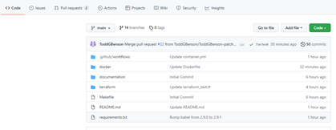
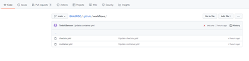
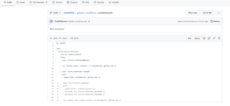

# GitHub Advanced Security

## Branch Protections
1) Select ‘Settings’

1) Click on ‘Branches’

1) Click ‘Add Rule’

1) Add Branch Name, click on “Require a pull request...” “Require checks” “Include administrators”

## SAST (Static Analysis Testing)
1) Go to Security and enable "set up code scanning"

2) Click on "Configure CodeQL alerts" to create a codeql scanning file

3) This will create a template file named codeql-analysis.yml under .github/workflows folder. Here we need to configure the scan as per our requirement.

4) First set the name of the workflow and the trigger for it. Here, we can configure the trigger based on any event such as a Pull Request or Push to a specific branch. Also, we can also make the workflow run on a certain schedule.

5) Next select the job and specify the runner in which the job should run. (This can be a github runner or a local runner)

6) Then intitialize codeql and build the application using autobuild.

7) Finally perform the scan for the repository and commmit the file to the repository.

8) Based on the triggers that we set earlier you could see the workflow getting executed under github actions

## Secrets
1) Select ‘Settings’

1) Click ‘Enable’ for Secret scanning

## SCA (Software Composition Analysis)
1) Select ‘Security’

1) Click on ‘Enable Dependabot alerts’

1) Click ‘Enable’ for Dependabot alerts and Dependabot security updates

##
## DAST (Dynamic Analysis Testing)
Sriram
## Terraform
1) Select ‘Marketplace’

1) Search for ‘Checkov’

1) Select ‘Checkov GitHub Action’

1) Click ‘Use Latest Version’

1) Click ‘Save to clipboard’

1) Create a new file in the repo

1) Name file ‘checkov.yml’ and paste code

1) Click on ‘Propose new file’

1) Click on ‘Create pull request’

1) Have pull request approved
## Container
1. Select the “workflows” folder

1. Add a file and name it “container.yaml”

` `

1. Run docker file against the container using the following commands 
   1. “Scandemo” – container name

